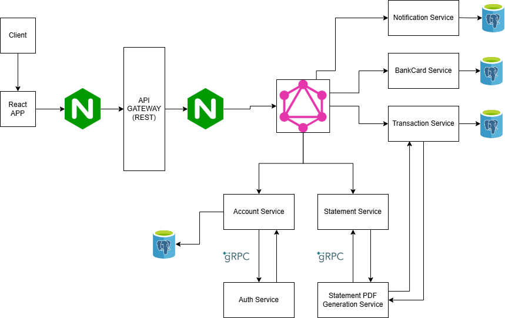

# Online Banking System
IT 3101A - Microservices / QA Final Project

## Golang Commands

   ```bash
   go run ./services/<ur-assigned-service> . 
   go get -u ./<ur-assigned-service> # Import external packages
   go mod tidy # on ur specific service directory for package cleanup/update
   ```

## How to run:

    ```bash
    # wait for api-gateway to run before running graphql api
    cd api-gateway 
      go run .
    cd graphql-api 
      go run . 
    cd .\internal-services\account\
      go run .
    cd .\internal-services\statement\
      go run .
    ```

## Note:
Utillize ``logger`` from finnbank/common/utils for terminal logs

## Service URL's
   ```bash
   # http ports
   http://localhost:8080/api # api-gateway 
   http://localhost:8083/graphql # graphql-api
   # gRPC ports
   http://localhost:9002/api/account # account-grpc
   http://localhost:9004/api/statement # statement-grpc 
   ```

## Generate proto for gRPC communication
   - Only do this if you added a proto file in ``Protobuf Directory``
   - This is to create gRPC services/communication of your respective service
   ```bash
   # install first
   go install google.golang.org/protobuf/cmd/protoc-gen-go@latest
   go install google.golang.org/grpc/cmd/protoc-gen-go-grpc@latest
   $env:PATH="$PATH:$(go env GOPATH)/bin"
   protoc --version # check installation

   # if its unrecognized then try:
   winget install protobuf

   # update proto_gen.bat
   start protoc \
        --proto_path=protobuf "protobuf/<change-lines-with-this-format>.proto" \

   # then generate
   ./proto_gen.bat
   ```

## Microservice Architecture
