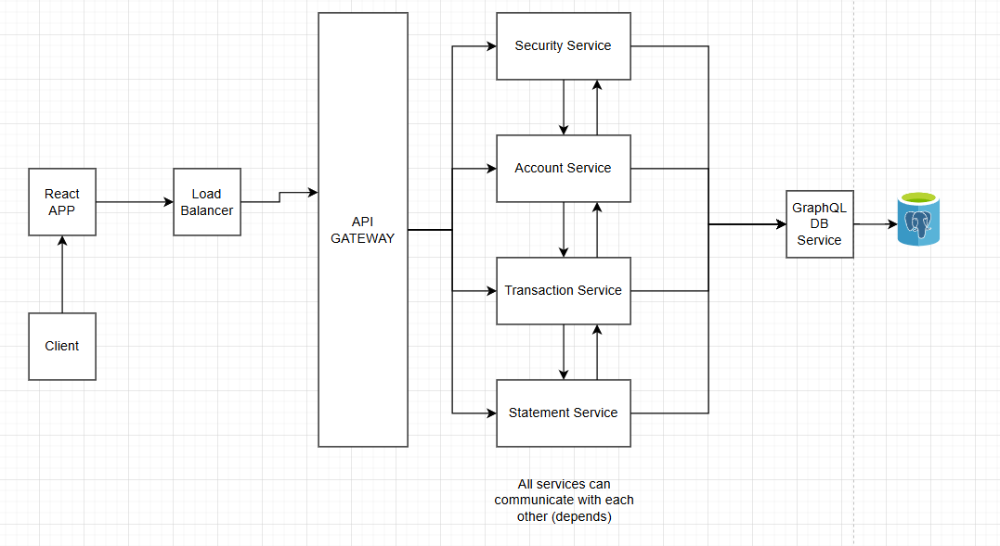

# Online Banking System
IT 3101A - Microservices / QA Final Project

## Golang Commands

   ```bash
   go run ./<ur-assigned-service> 
   go get ./<ur-assigned-service> # Import external packages
   ```

## Service URL's
   ```bash
   http://localhost:8080/api # api-gateway 
   http://localhost:8081/api/bankcard-service # bankcard-api 
   http://localhost:8082/api/account-service # account-api
   http://localhost:8083/api/graphql-service # graphql-api 
   http://localhost:8084/api/statement-service # statement-api 
   http://localhost:8085/api/transaction-service # transaction-api 
   
   # Swagger on a specific service for endpoint testing
   http://localhost:<port-of-ur-service>/swagger/index.html
   ```

## Microservice Architecture [Not Final]
